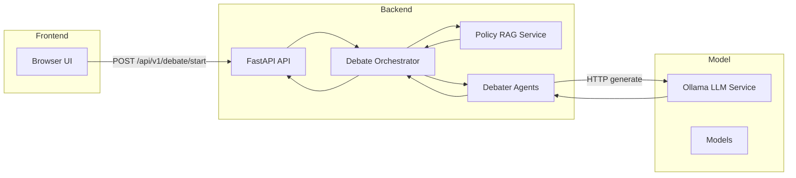

# AI-Powered Climate Policy Debate Simulator

A production-inspired, local-first multi-agent debate simulator built with FastAPI, Ollama, Docker, and a simple JSON-based retrieval layer.

## Overview

The application simulates a structured debate between three agents representing the USA, EU, and China. Each agent uses:

- its own persona and policy file
- a simple retrieval layer that surfaces relevant policy points
- a local Ollama model for response generation
- a shared turn-based debate history for context

The simulator exposes a REST API and a lightweight browser UI served from the FastAPI app.

## Project Structure

A concise view of the repository layout (adapt if additional files/folders exist):

```
.
├── agents/
├── core/
├── data/policies/
├── static/
├── tests/
├── docker-compose.yml
├── Dockerfile
├── requirements.txt
└── main.py
```

Adjust the tree above if your workspace contains additional modules or configuration files.

## Project Architecture

This section describes the high-level components and runtime flow of the simulator.

- **Frontend flow:** A minimal HTML/JS UI submits debate requests to the API, renders progress, and displays the final transcript.
- **FastAPI backend:** Serves the REST API and static assets, orchestrates rounds, and exposes health and policy endpoints.
- **Debate orchestrator:** `main.py` coordinates turn order, collects agent outputs, and assembles the transcript.
- **RAG / policy retrieval service:** `core/rag_service.py` loads `data/policies/*.json`, ranks relevant policy points, and provides context to agents.
- **Ollama integration:** `agents/debater.py` composes prompts, calls the local Ollama HTTP API, applies retries/timeouts, and normalizes responses.
- **Shared transcript/history:** The API maintains an in-memory round-based transcript used to inform future turns.
- **Docker networking:** `docker-compose.yml` places `api` and `ollama` on the same network so the API can reach Ollama at `http://ollama:11434`.

Short runtime flow:

1. User submits a topic + rounds via the UI or `POST /api/v1/debate/start`.
2. For each round, the orchestrator requests relevant policy points from the RAG service.
3. Each agent receives its policy context + recent transcript, calls Ollama, and returns a normalized turn.
4. The orchestrator appends the turn to the transcript and proceeds until all rounds complete.

### Architecture Diagram



## Setup

### Local Python Setup

1. Create a virtual environment.
2. Install dependencies:

```bash
pip install -r requirements.txt
```

3. Copy the example environment file.

Copy Environment File

Windows:

```powershell
copy .env.example .env
```

macOS / Linux:

```bash
cp .env.example .env
```

4. Start the API:

```bash
uvicorn main:app --host 0.0.0.0 --port 8000
```

### Docker Setup

Start the full system with:

```bash
docker compose up --build
```

This starts:

- `api` on port `8000`
- `ollama` on port `11434`

The compose file also configures health checks, restart policies, and default environment variables so the stack can start without extra manual wiring.

## Ollama Setup

The default configuration expects Ollama at `http://ollama:11434` inside Docker. The recommended model is `phi3`.

If you run locally without Docker, set:

```bash
OLLAMA_BASE_URL=http://localhost:11434
LLM_MODEL_NAME=phi3
OLLAMA_TIMEOUT=300
```

Make sure the model is available in Ollama before running a real debate:

```bash
ollama pull phi3
```

Interactive API Documentation

FastAPI automatically generates Swagger/OpenAPI documentation. When the API is running locally the interactive docs are available at:

```
http://localhost:8000/docs
```

## API Examples

### Health Check

```bash
curl http://localhost:8000/health
```

### Get a Policy Document

```bash
curl http://localhost:8000/policies/usa
```

### Start a Debate

```bash
curl -X POST http://localhost:8000/api/v1/debate/start \
  -H "Content-Type: application/json" \
  -d '{"topic":"Climate financing for developing countries","rounds":2}'
```

## Sample Debate Response

```json
{
  "messages": [
    {
      "round": 1,
      "agent": "USA",
      "message": "The United States supports targeted climate finance to ensure fairness and measurable outcomes.",
      "stance": "supportive",
      "timestamp": "2026-05-21T05:04:48.190878Z"
    }
  ]
}
```

## Frontend

Open `http://localhost:8000/` to use the browser UI.

The page is intentionally lightweight: a topic input, round selector, request button, and a formatted transcript panel with loading and error states.

## Tests

Run the test suite with:

```bash
pytest
```

## Screenshots

Add screenshots of the running application here.

Suggested screenshots:

- Home page before a debate starts
- Debate transcript after a completed run
- API docs page at `/docs`

## Troubleshooting

- If the debate endpoint returns `503`, confirm Ollama is running and the configured model exists.
- If Docker startup stalls, inspect the Ollama container logs first; the API waits for Ollama health before starting.
- If the browser UI shows validation errors, make sure the topic is not blank and rounds is between 1 and 5.
- If you run locally without Docker, ensure `OLLAMA_BASE_URL` points to your local Ollama instance.

## Future Improvements

- Replace simple JSON scoring with vector-based retrieval.
- Add persistent debate sessions.
- Add streaming responses for live transcript updates.
- Add richer debate analytics and export features.
- Add conversation memory persistence across requests.
- Add structured citations to each policy-grounded claim.


Demo video:
https://drive.google.com/file/d/1cwwpu-AX19AvL2sAJ5i5dLO52c6W4SaO/view?usp=sharing

Live video:
https://drive.google.com/file/d/1uQ1k9fj9QF5fzQllIZWAaUknqM5_TC0e/view?usp=sharing